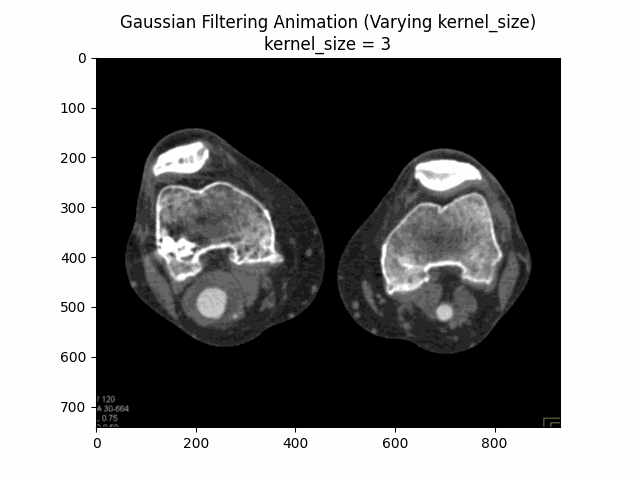
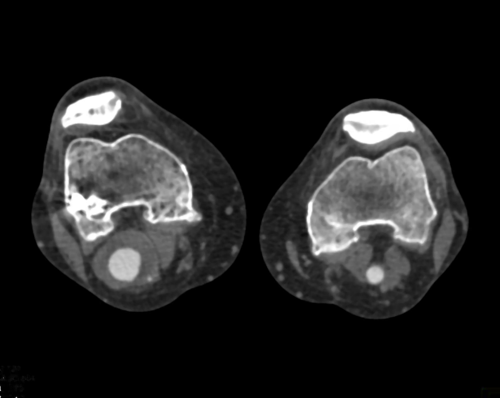
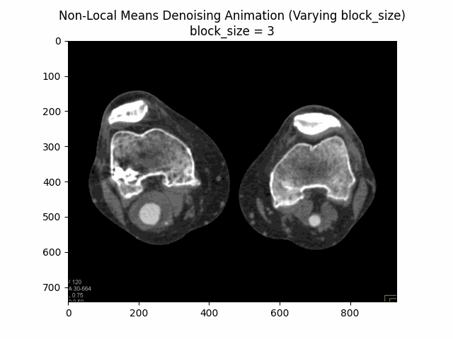
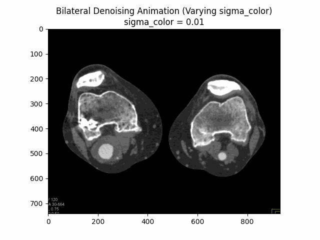

Supervised by [Dr. Malena Español](https://math.la.asu.edu/~mespanol/)

Popliteal artery aneurysms (PAAs) are focal dilations of the popliteal artery that pose a significant risk of rupture and limb loss. Accurate segmentation of PAAs from computed tomography (CT) scans is crucial for precise diagnosis and treatment planning. However, the presence of noise, intensity variations, and artifacts in CT images can hinder the performance of segmentation algorithms. This research investigates the effectiveness of pre-processing techniques in enhancing the segmentation accuracy of knee CT scans for PAA diagnosis and management. A comprehensive analysis of current pre-processing methods, their limitations, and potential advancements is presented. The study employs a dataset of knee CT scans with PAAs and applies various pre-processing techniques, including noise reduction, intensity normalization, and contrast enhancement. The impact of these techniques on segmentation accuracy is evaluated using metrics such as Dice similarity coefficient and Hausdorff distance. The results demonstrate that pre-processing significantly improves PAA segmentation accuracy, with specific techniques showing superior performance. The findings highlight the importance of incorporating pre-processing as a critical step in the PAA segmentation pipeline and provide insights into future research directions for enhancing the robustness and generalizability of these techniques. This research aims to contribute to the advancement of PAA diagnosis and treatment planning, ultimately leading to improved patient outcomes.

## Background

PAAs are focal dilations of the popliteal artery, often associated with abdominal aortic aneurysms and carrying a significant risk of rupture, which can lead to limb loss. Early and accurate diagnosis is crucial for timely intervention and preventing complications. CT imaging is widely used for detecting and evaluating PAAs, but the complexity of the knee joint's anatomy and the presence of noise, intensity variations, and artifacts can pose challenges for precise segmentation and diagnosis.

Pre-processing techniques, such as noise reduction, intensity normalization, contrast enhancement, and artifact removal, have shown promising results in improving the quality of medical images and enhancing the performance of segmentation algorithms. By addressing these issues, pre-processing can potentially facilitate more accurate delineation of PAAs and surrounding structures, aiding in diagnosis and treatment planning.

## Current State and Limitations

Current pre-processing techniques for CT scan segmentation encompass a range of methods, including noise reduction through techniques like anisotropic diffusion and non-local means filtering, intensity normalization via histogram matching, and contrast enhancement using adaptive histogram equalization. These techniques have demonstrated efficacy in improving segmentation accuracy for various applications, such as liver and lung segmentation.

However, several limitations persist in the current state of pre-processing for CT scan segmentation, particularly in the context of knee CT scans and PAA diagnosis. These limitations include:

1. Variability in scanning protocols: Differences in scanning parameters, equipment, and protocols can lead to variations in image quality, affecting the performance of pre-processing techniques and subsequent segmentation accuracy.
2. Complex anatomical structures: The knee joint and surrounding vascular structures exhibit intricate anatomical details and varying intensities, posing challenges for accurate segmentation, even with pre-processing.
3. Partial volume effects: Voxels containing a mixture of different tissue types can introduce inaccuracies in segmentation, particularly for small structures or aneurysms.
4. Optimal pre-processing pipeline: Determining the optimal combination and sequence of pre-processing techniques for a specific application or dataset remains a challenge, as different techniques may have varying impacts on segmentation accuracy.

To address these limitations and further advance the field of pre-processing for CT scan segmentation, ongoing research is required to develop adaptive and automated pre-processing pipelines, explore the integration of pre-processing with deep learning segmentation models, and investigate techniques to mitigate partial volume effects and enhance generalization across diverse datasets.

## Methods

In this section, we present the pre-processing techniques employed to enhance the segmentation accuracy of knee CT scans for popliteal artery aneurysm (PAA) diagnosis and management. The study investigates the effectiveness of three primary pre-processing methods: denoising, normalization, and edge detection. These techniques are applied to a dataset of knee CT scans with PAAs to evaluate their impact on the performance of segmentation algorithms.

Here is the original image of a knee CT scan with a popliteal artery aneurysm (PAA) before pre-processing (courtesy of [CTisus](https://ctisus.com/)):


### Denoising

Denoising is the process of removing or reducing unwanted noise from an image or signal. Noise can be introduced during image acquisition, transmission, or processing, and it can significantly degrade the quality and clarity of the image. Denoising is an essential step in many image processing pipelines, particularly in fields such as medical imaging, where accurate and reliable image data is crucial for diagnosis and analysis.

The primary purpose of denoising is to improve the signal-to-noise ratio (SNR) of an image, making it easier to extract meaningful information and perform subsequent tasks such as segmentation, feature extraction, or pattern recognition. By reducing noise, denoising techniques can enhance image quality, preserve important details, and improve the overall accuracy of image analysis algorithms.

Denoising is particularly important in medical imaging modalities like CT, MRI, and ultrasound, where noise can obscure subtle details or introduce artifacts that can lead to misinterpretation or missed diagnoses. Additionally, denoising can be beneficial in areas such as remote sensing, astronomical imaging, and microscopy, where noise can be a significant challenge due to the nature of the imaging process or the conditions under which the images are acquired.

There are various denoising techniques available, ranging from simple filters (e.g., median filters, Gaussian filters) to more advanced methods like wavelet-based denoising, non-local means denoising, and deep learning-based approaches. The choice of denoising method depends on factors such as the type of noise present, the characteristics of the image, and the specific application requirements.

#### Gaussian Filter

Gaussian filtering is a linear smoothing filter that helps reduce Gaussian noise while preserving edges in the image. It convolves the image with a Gaussian kernel to remove high-frequency components.

$$G(x, y) = \frac{1}{2\pi\sigma^2}e^{-\frac{x^2 + y^2}{2\sigma^2}}$$
$G$ s the Gaussian function, x and y are the distances from the origin in the horizontal and vertical directions, and $\sigma$ is the standard deviation of the Gaussian distribution.

```python
import cv2

def gaussian_denoising(image, kernel_size, sigma):
	return cv2.GaussianBlur(image, kernel_size, sigma)
```


##### Optimal Parameters

Through experimentation, the optimal parameters for Gaussian denoising were determined by varying the kernel size and sigma values.
The following visualizations demonstrate the impact of different kernel sizes and sigma values on the denoising process.

Varying Kernel Size with $\sigma = 1.5$:



Varying Sigma with Kernel Size $5 \times 5$:


Optimal Parameters: Kernel Size $5 \times 5$ and $\sigma = 1.5$.

#### Median Filter

Median filtering is a non-linear filtering technique that replaces each pixel value with the median value of its neighboring pixels within a specified kernel size. This method is effective in removing salt-and-pepper noise while preserving edges.

Unlike Gaussian or other linear filters, Median filtering doesn't have a formula like Gaussian does. Instead, it works by moving through the image pixel by pixel, replacing each value with the median value of neighboring pixels. This includes the pixel itself and others located in the surrounding neighborhood defined by the kernel size.

This method is particularly effective against salt-and-pepper noise. The median is calculated by first sorting all the pixel values from the surrounding neighborhood into numerical order and then replacing the pixel being considered with the middle value. If the kernel size is a even number, the average of the two middle numbers is taken.

```python
import cv2

def median_denoising(image, kernel_size):
	return cv2.medianBlur(image, kernel_size)
```



##### Optimal Parameters

Varying Kernel Size:


As seen in the visualization, the optimal kernel size for median denoising is $3 \times 3$.
As the kernel size increases, the denoising effect becomes more pronounced, but it may also blur the image and lose fine details.

#### Non-Local Means Denoising

Non-Local Means Denoising is a more advanced technique that takes advantage of the redundancy present in images. It replaces each pixel value with a weighted average of similar pixels in the image, considering both spatial and intensity similarities.

$$\hat{u}(i)=\frac{1}{C(i)}\sum_{j\in I}w(i,j)v(j)$$
where $\hat{u}(i)$ is the denoised image, $v(j)$ is the noisy image, $I$ is the set of all pixels in the image, and $w(i,j)$ is the weight function reflecting the similarity between $i$ and $j$. The term $C(i)$ is a normalization term ensuring that the weights sum to one, defined as $C(i)=\sum_{j\in I}w(i,j)$.

```python
import cv2

def non_local_means_denoising(image, filter_strength):
	return cv2.fastNlMeansDenoisingColored(image, None, filter_strength, filter_strength, 7, 21)
```


##### Optimal Parameters

Varying block size with search window size $21$ and filter strength $10$:



Varying search window size with block size $7$ and filter strength $10$:


Varying filter strength (h) with block size $7$ and search window size $21$:


Optimal Parameters: Block Size $7$, Search Window Size $21$, and Filter Strength $10$.

#### Total Variation Filter

The Total Variation Filter is a denoising method that aims to preserve sharp edges while removing noise from the image. It minimizes the total variation norm, which is the L1 norm of the gradient of the image, while keeping the denoised image as close as possible to the original image.

The Total Variation Filter aims to minimize the total variation (TV) norm, which measures the total amount of variation or gradient within an image. Mathematically, the goal is to find an image that is close to the noisy image but with a lower TV norm. The optimization problem can be described by:
$$\min_u \left\{ \frac{1}{2} \int (u - v)^2 \, dx + \lambda \int |\nabla u| \, dx \right\}$$
Here, $u$ is the denoised image, $v$ is the noisy input image, $\lambda$ is a parameter that controls the trade-off between fidelity to the original image and smoothness of the output, and $|\nabla u|$ represents the magnitude of the gradient (TV norm) of the image $u$.

```python
from skimage.restoration import denoise_tv_chambolle

def tv_denoising(image, weight=0.1):
	return denoise_tv_chambolle(image, weight=weight)
```


##### Optimal Parameters

Varying Weight:


Optimal Weight: $0.1$.

#### Bilateral Filter

The Bilateral Filter is an edge-preserving and noise-reducing filter. It averages pixels based on their spatial closeness and radiometric similarity. This means that pixels are weighted not only by their spatial distance but also by their intensity difference, preserving edges while smoothing out noise.

The Bilateral Filter is designed to reduce noise while preserving edges by combining spatial and range kernels. It is given by:

$$BF[I]_p = \frac{1}{W_p} \sum_{q \in S} I_q \cdot f(||p-q||) \cdot g(|I_p - I_q|)$$

In this formula, $I_p$ and $I_q$ are the intensity values of pixels $p$ and $q$, respectively, $S$ is the spatial neighborhood around pixel $p$, $f$ is the spatial kernel (usually Gaussian), and $g$ is the intensity-range kernel (also typically Gaussian). $W_p$ is a normalization factor:

$$W_p = \sum_{q \in S} f(||p-q||) \cdot g(|I_p - I_q|)$$

```python
from skimage.restoration import denoise_bilateral

def bilateral_denoising(image, win_size=5, sigma_color=0.1, sigma_spatial=15):
    return denoise_bilateral(image, win_size=win_size, sigma_color=sigma_color, sigma_spatial=sigma_spatial)
```


##### Optimal Parameters

Varying Sigma Color:



Varying Sigma Spatial:


Optimal Parameters: Sigma Color $0.1$ and Sigma Spatial $15$.

#### Wavelet Denoising Filter

The Wavelet Denoising Filter relies on the wavelet representation of the image. Noise is typically represented by small values in the wavelet domain, which can be set to zero or thresholded to remove the noise while preserving the important features of the image.

$$\hat{u} = \sum_{\lambda} \hat{c}_{\lambda} \psi_{\lambda}$$

where $\hat{c}_{\lambda}$ are the thresholded wavelet coefficients, $\psi_{\lambda}$ are the wavelet basis functions, and $\lambda$ indexes the different coefficients in the wavelet transform. The coefficients are obtained by:

$$c_{\lambda} = \langle v, \psi_{\lambda} \rangle$$

```python
from skimage.restoration import denoise_wavelet

def wavelet_denoising(image, method='BayesShrink', mode='soft', wavelet='db1', rescale_sigma=True):
    return denoise_wavelet(image, method=method, mode=mode, wavelet=wavelet, rescale_sigma=rescale_sigma)
```


##### Optimal Parameters

Varying Threshold:


Optimal Threshold: $0.1$.
