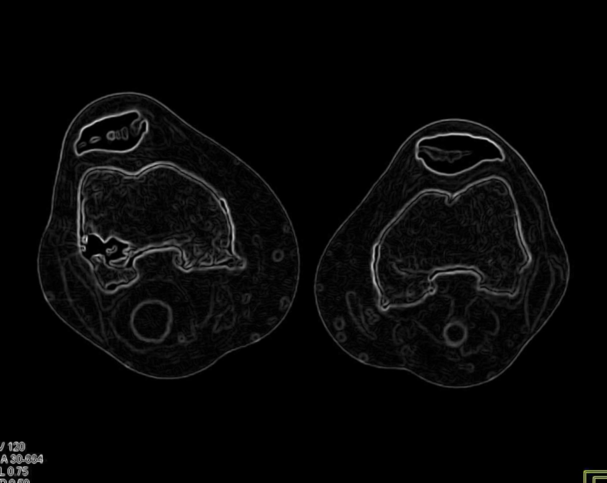
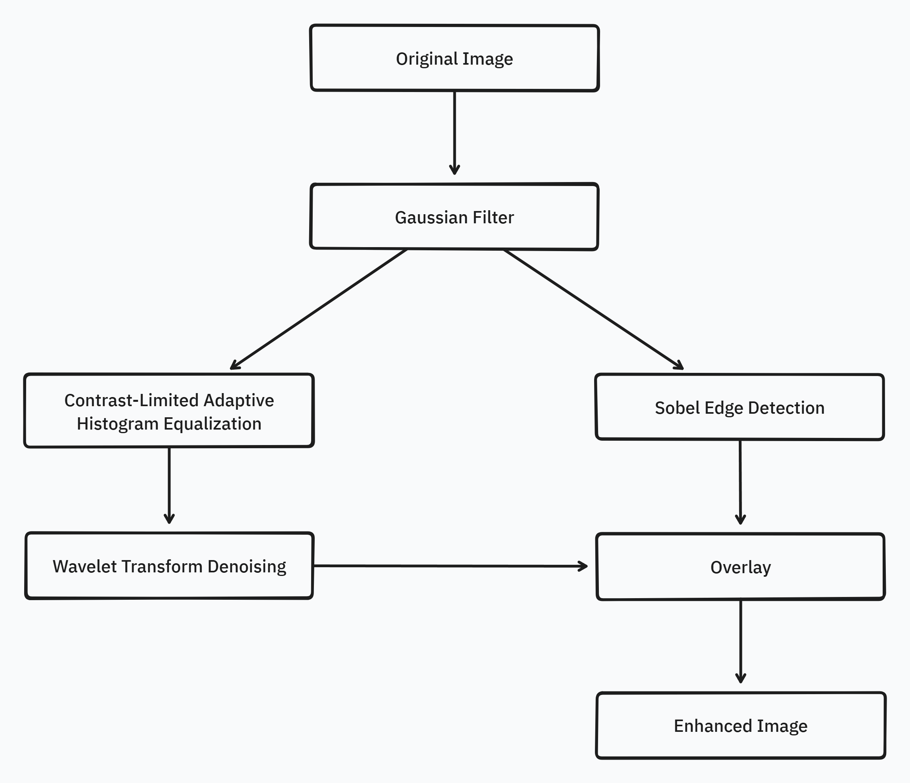

Supervised by [Dr. Malena Español](https://math.la.asu.edu/~mespanol/)

## Abstract

Popliteal artery aneurysms (PAAs) are focal dilations of the popliteal artery that pose a significant risk of rupture and limb loss. Accurate segmentation of PAAs from computed tomography (CT) scans is crucial for precise diagnosis and treatment planning. However, the presence of noise, intensity variations, and artifacts in CT images can hinder the performance of segmentation algorithms. This research investigates the effectiveness of pre-processing techniques in enhancing the segmentation accuracy of knee CT scans for PAA diagnosis and management. A comprehensive analysis of current pre-processing methods, their limitations, and potential advancements is presented. The study employs a dataset of knee CT scans with PAAs and applies various pre-processing techniques, including noise reduction, intensity normalization, and contrast enhancement. The impact of these techniques on segmentation accuracy is evaluated using metrics such as Dice similarity coefficient and Hausdorff distance. The results demonstrate that pre-processing significantly improves PAA segmentation accuracy, with specific techniques showing superior performance. The findings highlight the importance of incorporating pre-processing as a critical step in the PAA segmentation pipeline and provide insights into future research directions for enhancing the robustness and generalizability of these techniques. This research aims to contribute to the advancement of PAA diagnosis and treatment planning, ultimately leading to improved patient outcomes.

## Background

PAAs are focal dilations of the popliteal artery, often associated with abdominal aortic aneurysms and carrying a significant risk of rupture, which can lead to limb loss. Early and accurate diagnosis is crucial for timely intervention and preventing complications. CT imaging is widely used for detecting and evaluating PAAs, but the complexity of the knee joint's anatomy and the presence of noise, intensity variations, and artifacts can pose challenges for precise segmentation and diagnosis.

Pre-processing techniques, such as noise reduction, intensity normalization, contrast enhancement, and artifact removal, have shown promising results in improving the quality of medical images and enhancing the performance of segmentation algorithms. By addressing these issues, pre-processing can potentially facilitate more accurate delineation of PAAs and surrounding structures, aiding in diagnosis and treatment planning.

## Current State and Limitations

Current pre-processing techniques for CT scan segmentation encompass a range of methods, including noise reduction through techniques like anisotropic diffusion and non-local means filtering, intensity normalization via histogram matching, and contrast enhancement using adaptive histogram equalization. These techniques have demonstrated efficacy in improving segmentation accuracy for various applications, such as liver and lung segmentation.

However, several limitations persist in the current state of pre-processing for CT scan segmentation, particularly in the context of knee CT scans and PAA diagnosis. These limitations include:

1. Variability in scanning protocols: Differences in scanning parameters, equipment, and protocols can lead to variations in image quality, affecting the performance of pre-processing techniques and subsequent segmentation accuracy.
2. Complex anatomical structures: The knee joint and surrounding vascular structures exhibit intricate anatomical details and varying intensities, posing challenges for accurate segmentation, even with pre-processing.
3. Partial volume effects: Voxels containing a mixture of different tissue types can introduce inaccuracies in segmentation, particularly for small structures or aneurysms.
4. Optimal pre-processing pipeline: Determining the optimal combination and sequence of pre-processing techniques for a specific application or dataset remains a challenge, as different techniques may have varying impacts on segmentation accuracy.

To address these limitations and further advance the field of pre-processing for CT scan segmentation, ongoing research is required to develop adaptive and automated pre-processing pipelines, explore the integration of pre-processing with deep learning segmentation models, and investigate techniques to mitigate partial volume effects and enhance generalization across diverse datasets.

## Methods

In this section, we present the pre-processing techniques employed to enhance the segmentation accuracy of knee CT scans for popliteal artery aneurysm (PAA) diagnosis and management. The study investigates the effectiveness of three primary pre-processing methods: denoising, normalization, and edge detection. These techniques are applied to a dataset of knee CT scans with PAAs to evaluate their impact on the performance of segmentation algorithms.

Here is the original image of a knee CT scan with a popliteal artery aneurysm (PAA) before pre-processing (courtesy of [CTisus](https://ctisus.com/)):


### Denoising

Denoising is the process of removing or reducing unwanted noise from an image or signal. Noise can be introduced during image acquisition, transmission, or processing, and it can significantly degrade the quality and clarity of the image. Denoising is an essential step in many image processing pipelines, particularly in fields such as medical imaging, where accurate and reliable image data is crucial for diagnosis and analysis.

The primary purpose of denoising is to improve the signal-to-noise ratio (SNR) of an image, making it easier to extract meaningful information and perform subsequent tasks such as segmentation, feature extraction, or pattern recognition. By reducing noise, denoising techniques can enhance image quality, preserve important details, and improve the overall accuracy of image analysis algorithms.

Denoising is particularly important in medical imaging modalities like CT, MRI, and ultrasound, where noise can obscure subtle details or introduce artifacts that can lead to misinterpretation or missed diagnoses. Additionally, denoising can be beneficial in areas such as remote sensing, astronomical imaging, and microscopy, where noise can be a significant challenge due to the nature of the imaging process or the conditions under which the images are acquired.

There are various denoising techniques available, ranging from simple filters (e.g., median filters, Gaussian filters) to more advanced methods like wavelet-based denoising, non-local means denoising, and deep learning-based approaches. The choice of denoising method depends on factors such as the type of noise present, the characteristics of the image, and the specific application requirements.

#### Gaussian Filter

Gaussian filtering is a linear smoothing filter that helps reduce Gaussian noise while preserving edges in the image. It convolves the image with a Gaussian kernel to remove high-frequency components.

$$G(x, y) = \frac{1}{2\pi\sigma^2}e^{-\frac{x^2 + y^2}{2\sigma^2}}$$

$G$ s the Gaussian function, x and y are the distances from the origin in the horizontal and vertical directions, and $\sigma$ is the standard deviation of the Gaussian distribution.

```python
import cv2

def gaussian_denoising(image, kernel_size, sigma):
	return cv2.GaussianBlur(image, kernel_size, sigma)
```


Through experimentation, the optimal parameters for Gaussian denoising were determined by varying the kernel size and sigma values.
The following visualizations demonstrate the impact of different kernel sizes and sigma values on the denoising process.

Varying Kernel Size with $\sigma = 1.5$:


Varying Sigma with Kernel Size $5 \times 5$:


Optimal Parameters: Kernel Size $5 \times 5$ and $\sigma = 1.5$.

#### Median Filter

Median filtering is a non-linear filtering technique that replaces each pixel value with the median value of its neighboring pixels within a specified kernel size. This method is effective in removing salt-and-pepper noise while preserving edges.

Unlike Gaussian or other linear filters, Median filtering doesn't have a formula like Gaussian does. Instead, it works by moving through the image pixel by pixel, replacing each value with the median value of neighboring pixels. This includes the pixel itself and others located in the surrounding neighborhood defined by the kernel size.

This method is particularly effective against salt-and-pepper noise. The median is calculated by first sorting all the pixel values from the surrounding neighborhood into numerical order and then replacing the pixel being considered with the middle value. If the kernel size is a even number, the average of the two middle numbers is taken.

```python
import cv2

def median_denoising(image, kernel_size):
	return cv2.medianBlur(image, kernel_size)
```


Varying Kernel Size:


As seen in the visualization, the optimal kernel size for median denoising is $3 \times 3$.
As the kernel size increases, the denoising effect becomes more pronounced, but it may also blur the image and lose fine details.

#### Non-Local Means Denoising

Non-Local Means Denoising is a more advanced technique that takes advantage of the redundancy present in images. It replaces each pixel value with a weighted average of similar pixels in the image, considering both spatial and intensity similarities.

$$\hat{u}(i)=\frac{1}{C(i)}\sum_{j\in I}w(i,j)v(j)$$

where $\hat{u}(i)$ is the denoised image, $v(j)$ is the noisy image, $I$ is the set of all pixels in the image, and $w(i,j)$ is the weight function reflecting the similarity between $i$ and $j$. The term $C(i)$ is a normalization term ensuring that the weights sum to one, defined as $C(i)=\sum_{j\in I}w(i,j)$.

```python
import cv2

def non_local_means_denoising(image, filter_strength):
	return cv2.fastNlMeansDenoisingColored(image, None, filter_strength, filter_strength, 7, 21)
```


Varying block size with search window size $21$ and filter strength $10$:


Varying search window size with block size $7$ and filter strength $10$:


Varying filter strength (h) with block size $7$ and search window size $21$:


Optimal Parameters: Block Size $7$, Search Window Size $21$, and Filter Strength $10$.

#### Total Variation Filter

The Total Variation Filter is a denoising method that aims to preserve sharp edges while removing noise from the image. It minimizes the total variation norm, which is the L1 norm of the gradient of the image, while keeping the denoised image as close as possible to the original image.

The Total Variation Filter aims to minimize the total variation (TV) norm, which measures the total amount of variation or gradient within an image. Mathematically, the goal is to find an image that is close to the noisy image but with a lower TV norm. The optimization problem can be described by:

$$\min_u \left\{ \frac{1}{2} \int (u - v)^2 \, dx + \lambda \int |\nabla u| \, dx \right\}$$

Here, $u$ is the denoised image, $v$ is the noisy input image, $\lambda$ is a parameter that controls the trade-off between fidelity to the original image and smoothness of the output, and $|\nabla u|$ represents the magnitude of the gradient (TV norm) of the image $u$.

```python
from skimage.restoration import denoise_tv_chambolle

def tv_denoising(image, weight=0.1):
	return denoise_tv_chambolle(image, weight=weight)
```


Varying Weight:


Optimal Weight: $0.1$.

#### Bilateral Filter

The Bilateral Filter is an edge-preserving and noise-reducing filter. It averages pixels based on their spatial closeness and radiometric similarity. This means that pixels are weighted not only by their spatial distance but also by their intensity difference, preserving edges while smoothing out noise.

The Bilateral Filter is designed to reduce noise while preserving edges by combining spatial and range kernels. It is given by:

$$BF[I]_p = \frac{1}{W_p} \sum_{q \in S} I_q \cdot f(||p-q||) \cdot g(|I_p - I_q|)$$

In this formula, $I_p$ and $I_q$ are the intensity values of pixels $p$ and $q$, respectively, $S$ is the spatial neighborhood around pixel $p$, $f$ is the spatial kernel (usually Gaussian), and $g$ is the intensity-range kernel (also typically Gaussian). $W_p$ is a normalization factor:

$$W_p = \sum_{q \in S} f(||p-q||) \cdot g(|I_p - I_q|)$$

```python
from skimage.restoration import denoise_bilateral

def bilateral_denoising(image, win_size=5, sigma_color=0.1, sigma_spatial=15):
    return denoise_bilateral(image, win_size=win_size, sigma_color=sigma_color, sigma_spatial=sigma_spatial)
```


Varying Sigma Color:


Varying Sigma Spatial:


Optimal Parameters: Sigma Color $0.1$ and Sigma Spatial $15$.

#### Wavelet Denoising Filter

The Wavelet Denoising Filter relies on the wavelet representation of the image. Noise is typically represented by small values in the wavelet domain, which can be set to zero or thresholded to remove the noise while preserving the important features of the image.

$$\hat{u} = \sum_{\lambda} \hat{c}_{\lambda} \psi_{\lambda}$$

where $\hat{c}_{\lambda}$ are the thresholded wavelet coefficients, $\psi_{\lambda}$ are the wavelet basis functions, and $\lambda$ indexes the different coefficients in the wavelet transform. The coefficients are obtained by:

$$c_{\lambda} = \langle v, \psi_{\lambda} \rangle$$

```python
from skimage.restoration import denoise_wavelet

def wavelet_denoising(image, method='BayesShrink', mode='soft', wavelet='db1', rescale_sigma=True):
    return denoise_wavelet(image, method=method, mode=mode, wavelet=wavelet, rescale_sigma=rescale_sigma)
```


Varying Threshold:


Optimal Threshold: $0.1$.

### Normalization

Normalization is the process of adjusting or transforming the intensity values of an image to a common scale or range. It is a crucial step in many image processing and analysis pipelines, particularly in medical imaging, where images from different sources, modalities, or acquisition parameters may exhibit varying intensity distributions.

The primary goal of normalization is to ensure that intensity values representing similar structures or tissues are consistent across different images or datasets. This consistency is essential for tasks such as image registration, segmentation, and quantitative analysis, where intensity values play a crucial role in identifying and distinguishing different structures or regions of interest.

Normalization is particularly important in medical imaging applications, where images from different scanners, acquisition protocols, or patient populations may have varying intensity distributions. For example, in CT imaging, the same tissue type may have different intensity values across different scans due to variations in scanner calibration, exposure settings, or patient factors. Normalization can help to overcome these variations and ensure that similar tissues have consistent intensity representations, which is crucial for accurate diagnosis and analysis.

There are various normalization techniques available, including histogram matching, intensity windowing, z-score normalization, percentile normalization, and contrast limited adaptive histogram equalization (CLAHE). The choice of normalization method depends on factors such as the characteristics of the image data, the specific application requirements, and the desired outcome.

Normalization is also important in other fields, such as computer vision and machine learning, where consistent and standardized input data is often required for training and inference tasks. By normalizing the input data, these techniques can achieve better performance, improved generalization, and more reliable results.

#### Histogram Matching

Histogram matching is a technique used to match the intensity distribution of one image to that of a reference image. This can be useful for normalizing the intensity values across different CT scans, ensuring that tissues with similar densities have consistent intensity values, even when scanned under different conditions or on different scanners.

The basic idea behind histogram matching is to find a mapping function that transforms the intensity distribution of the source image to match the intensity distribution of the reference image. This mapping function is then applied to the source image, effectively normalizing its intensity values to match the reference. This is achieved through a mapping function derived from the cumulative distribution functions (CDFs) of the two images.

$$T(r) = G^{-1}(F(r))$$

The transformation function applied to the source image is denoted as $T(r)$, where $r$ represents the pixel values of the source image.

$F(r)$ is the cumulative distribution function of the source image.

$G^{-1}$ is the inverse cumulative distribution function of the reference image.

```python
from skimage.exposure import match_histograms

def histogram_matching(image, reference):
    return match_histograms(image, reference, multichannel=True)
```

#### Intensity Windowing

Intensity windowing is a widely used technique in medical imaging, particularly for CT scans. It involves adjusting the window level and window width to display a specific range of intensity values, emphasizing or suppressing certain structures based on their density.

The window level determines the midpoint of the intensity range to be displayed, while the window width controls the range of intensities around the midpoint to be displayed. By adjusting these parameters, radiologists can optimize the visualization of specific structures, such as bones, soft tissues, or tumors.

Intensity windowing can also be used for normalization purposes by applying a consistent window level and width across different CT scans, ensuring that tissues with similar densities have consistent intensity values.

Intensity windowing adjusts the range of pixel intensities that are visible in an image based on a defined window level and window width. It's particularly useful in medical imaging for highlighting specific features.

$$I_{windowed} = \frac{\text{clip}(I, WL - \frac{WW}{2}, WL + \frac{WW}{2}) - (WL - \frac{WW}{2})}{WW} \times 255$$

$I$ is the original image

$WL$ (Window Level) is the midpoint of the desired intensity range

$WW$ (Window Width) is the size of the range around $WL$

The result $I_{windowed}$ is scaled between 0 and 255.

```python
import numpy as np

def intensity_windowing(image, window_level, window_width):
    window_min = window_level - (window_width // 2)
    window_max = window_level + (window_width // 2)
    image_windowed = np.clip(image, window_min, window_max)
    return (image_windowed - window_min) / (window_max - window_min) * 255
```


Varying Window Level:


Varying Window Width:


Optimal Parameters: Window Level $50$ and Window Width $200$.

#### Z-Score Normalization

Z-score normalization, also known as standard score normalization, is a technique used to standardize the range of intensity values in an image. It centers the intensity distribution around a mean of 0 and scales it to have a standard deviation of 1. This normalization method is particularly useful when dealing with images from different sources or acquired under different conditions, as it ensures that the intensity values are comparable across different datasets.

The principle behind z-score normalization is to subtract the mean intensity value from each pixel and then divide by the standard deviation of the intensity values. This transformation ensures that the resulting intensity distribution has a mean of 0 and a standard deviation of 1.

Z-score normalization is widely used in various applications, including medical image analysis, computer vision, and machine learning. It can help to improve the performance of image processing algorithms by reducing the influence of outliers and ensuring that the intensity values are on a common scale. Additionally, z-score normalization can be beneficial for certain image enhancement techniques, such as contrast stretching or histogram equalization, as it can improve the effectiveness of these methods by normalizing the input data.

$$I_{normalized} = \frac{I - \mu}{n \sigma}$$

In this equation, $I$ represents the original image, $\mu$ is the mean intensity value of the image, and $\sigma$ is the standard deviation of the intensity values. The resulting $I_{normalized}$ is the z-score normalized image, where the intensity values have been centered around $0$ and scaled to have a standard deviation of $1$. The additional factor $n$ is used to scale the standard deviation to avoid over-amplification of the intensity values.

```python
import numpy as np

def z_score_normalization(image, n = 1):
    mean = np.mean(image)
    std = np.std(image)
    return (image - mean) / (n * std)
```


Varying Scaling Factor:


Optimal Scaling Factor: $2$.

#### Percentile Normalization

Percentile normalization is a technique used to normalize the intensity values of an image based on specific percentiles of the intensity distribution. It is particularly useful for reducing the influence of outliers or extreme intensity values, which can be common in medical imaging due to factors such as noise or artifacts.

The basic idea behind percentile normalization is to set a lower and upper percentile value, and then linearly scale the intensity values between these two percentiles to a desired range. Intensity values below the lower percentile are set to the minimum value of the desired range, and intensity values above the upper percentile are set to the maximum value of the desired range.

Percentile normalization is commonly used in medical image analysis, particularly for preprocessing and normalization of CT or MRI scans. It can help to ensure that the intensity values of different tissues or structures are consistently represented across different scans or imaging modalities, which can be crucial for tasks such as segmentation, registration, or computer-aided diagnosis.

$$I_{normalized} = \frac{\text{clip}(I - P_l, 0, P_u - P_l)}{P_u - P_l}$$

In this equation, $I$ represents the original image, $P_l$ is the lower percentile value (e.g., 5th percentile), and $P_u$ is the upper percentile value (e.g., 95th percentile). The $\text{clip}$ function ensures that intensity values below $P_l$ are set to $0$, and intensity values above $P_u - P_l$ are set to $1$. The resulting $I_{normalized}$ is the percentile normalized image, where the intensity values have been scaled to a range of $[0, 1]$ based on the specified percentile values.

```python
import numpy as np

def percentile_normalization(image, lower_percentile=5, upper_percentile=95):
    lower_value = np.percentile(image, lower_percentile)
    upper_value = np.percentile(image, upper_percentile)
    normalized = (image - lower_value) / (upper_value - lower_value)
    return np.clip(normalized, 0, 1)
```


Varying Lower and Upper Percentiles:


#### Contrast Limited Adaptive Histogram Equalization (CLAHE)

Contrast Limited Adaptive Histogram Equalization (CLAHE) is a technique used to improve the local contrast of an image by applying histogram equalization on individual regions or tiles of the image. Unlike global histogram equalization, which can over-amplify noise and result in undesirable artifacts, CLAHE operates on small regions of the image, limiting the contrast enhancement in areas with high contrast.

CLAHE is particularly useful for enhancing the visibility of details in medical images, such as CT scans or X-rays, where different regions of the image may have varying contrast levels. By applying CLAHE, the contrast in low-contrast regions can be improved, while preventing over-enhancement in high-contrast areas, resulting in better overall image quality and detail preservation.

The CLAHE algorithm works by dividing the image into non-overlapping tiles or regions. For each tile, a histogram of the intensity values is computed, and histogram equalization is applied to redistribute the intensity values within that tile. To prevent over-amplification of noise or artifacts, the histogram is clipped at a specified limit before computing the cumulative distribution function (CDF) used for histogram equalization.

CLAHE enhances the contrast of images by transforming the local histograms. It limits the amplification of noise by clipping the histogram at a specified limit before computing the cumulative histogram.

$$\text{CLAHE}(I) = \sum_{\text{tile}} \text{clip}(\text{histogram}(I_{\text{tile}}), \text{clip\_limit}) \cdot \text{CDF}$$

Here, $I$ is the input image divided into tiles, and each tile's histogram is clipped at the $\text{clip\_limit}$. The cumulative distribution function (CDF) is then used to map the pixel values, enhancing contrast locally within each tile.

$n$ this equation, $I$ represents the input image divided into tiles, and $\text{clip}(\text{histogram}(I_{\text{tile}}), \text{clip\_limit})$ denotes the clipping of the histogram for each tile at a specified $\text{clip\_limit}$. The cumulative distribution function (CDF) is then used to map the pixel values, enhancing contrast locally within each tile. The resulting $\text{CLAHE}(I)$ is the contrast-enhanced image with improved local contrast and reduced noise amplification.

CLAHE is widely used in various medical imaging applications, such as CT scan analysis, X-ray imaging, and microscopy, to improve the visibility of details and enhance the diagnostic quality of the images.

```python
from skimage.exposure import equalize_adapthist

def clahe_normalization(image, kernel_size=None, clip_limit=0.01, nbins=256):
    return equalize_adapthist(image, kernel_size=kernel_size, clip_limit=clip_limit, nbins=nbins)
```


Varying Clip Limit with $8 \times 8$ Kernel Size and $256$ Bins:


Varying Kernel Size with $0.01$ Clip Limit and $256$ Bins:


Varying Number of Bins with $0.01$ Clip Limit and $8 \times 8$ Kernel Size:


Optimal Parameters: Clip Limit $0.01$, Kernel Size $8 \times 8$, and Number of Bins $256$.

### Edge Detection

This study investigates the effectiveness of four edge detection methods in enhancing the segmentation accuracy of knee CT scans for popliteal artery aneurysm (PAA) diagnosis and management. The primary objective is to identify the boundaries of the aneurysm and surrounding vascular structures, providing valuable information for subsequent segmentation algorithms. The edge detection methods explored in this research include gradient-based techniques, which utilize first-order derivatives to detect changes in image intensity, and Laplacian-based approaches, which employ second-order derivatives to identify regions of rapid intensity change.

The performance of these edge detection methods is evaluated in conjunction with other pre-processing techniques, such as denoising and normalization, to assess their combined impact on PAA segmentation accuracy. The study aims to determine the optimal combination of pre-processing techniques that yield the highest segmentation accuracy, as measured by metrics such as the Dice similarity coefficient and Hausdorff distance.

The results demonstrate the importance of edge detection as a pre-processing step in the PAA segmentation pipeline, with the incorporation of edge information obtained from the selected methods significantly improving the accuracy and robustness of PAA segmentation in knee CT scans. Furthermore, the study highlights the potential of these edge detection techniques to address the limitations posed by the complex anatomical structures of the knee joint and surrounding vasculature.

#### Sobel Edge Detection

The Sobel edge detection method is a gradient-based technique that employs a pair of 3x3 convolution kernels to approximate the horizontal and vertical derivatives of an image. It is a computationally efficient and widely used method for edge detection in various image processing applications, including medical image analysis.

The Sobel operator consists of two kernels, $G_x$ and $G_y$, which are convolved with the input image $I$ to calculate the gradient approximations in the horizontal and vertical directions, respectively:

$$
G_x = \begin{bmatrix}
-1 & 0 & +1 \\
-2 & 0 & +2 \\
-1 & 0 & +1
\end{bmatrix} * I
$$

$$
G_y = \begin{bmatrix}
-1 & -2 & -1 \\
0 & 0 & 0 \\
+1 & +2 & +1
\end{bmatrix} * I
$$

The gradient magnitude $G$ can be computed using the Euclidean norm of the gradient approximations:

$$G = \sqrt{G_x^2 + G_y^2}$$

Alternatively, for computational efficiency, the gradient magnitude can be approximated using the absolute values of the gradient approximations:

$$G = |G_x| + |G_y|$$

The gradient direction $\theta$ can be calculated using the arctangent of the ratio between the vertical and horizontal gradient approximations:

$$\theta = \arctan\left(\frac{G_y}{G_x}\right)$$

Pixels with gradient magnitudes exceeding a specified threshold are considered edge pixels, while those below the threshold are classified as non-edge pixels.

```python
import cv2
import numpy as np

def sobel_edge_detection(image, ksize:int = 3):
    image = image.astype(np.float32)

    sobelx = cv2.Sobel(image, cv2.CV_64F, 1, 0, ksize=ksize)
    sobely = cv2.Sobel(image, cv2.CV_64F, 0, 1, ksize=ksize)

    sobel = np.sqrt(sobelx**2 + sobely**2)
    sobel = cv2.normalize(sobel, None, 0, 255, cv2.NORM_MINMAX)
    return sobel.astype(np.uint8)
```



Varying Kernel Size:


Optimal Kernel Size: $3$.

#### Canny Edge Detection

The Canny edge detection algorithm is a multi-stage process that aims to detect a wide range of edges in an image while minimizing false positives and ensuring good localization of the detected edges. It is widely regarded as the optimal edge detection method due to its robustness and ability to handle noise in images.

The Canny edge detection algorithm consists of the following steps:

1. **Gaussian smoothing**: The input image $I$ is convolved with a Gaussian filter $G_\sigma$ to reduce noise and smooth the image:

$$I_{smooth} = G_\sigma * I$$

2. **Gradient computation**: The horizontal and vertical gradients, $G_x$ and $G_y$, are computed using finite difference approximations or by convolving the smoothed image with appropriate kernels, such as the Sobel operator:

$$G_x = \frac{\partial I_{smooth}}{\partial x}, \quad G_y = \frac{\partial I_{smooth}}{\partial y}$$

3. **Non-maximum suppression**: The gradient magnitude $G$ and direction $\theta$ are computed, and non-maximum suppression is applied to thin the edges, preserving only the local maxima of the gradient magnitude:

$$G = \sqrt{G_x^2 + G_y^2}, \quad \theta = \arctan\left(\frac{G_y}{G_x}\right)$$

$$I_{thin} = \text{non\_max\_suppression}(G, \theta)$$

4. **Double thresholding**: Two threshold values, $T_{low}$ and $T_{high}$, are used to classify the remaining edge pixels into strong, weak, and non-edge pixels. Pixels with gradient magnitudes above $T_{high}$ are considered strong edges, while pixels with gradient magnitudes between $T_{low}$ and $T_{high}$ are considered weak edges.

5. **Edge tracking by hysteresis**: The final step involves connecting the strong and weak edges to form continuous edge segments using hysteresis thresholding:

$$I_{edge} = \text{hysteresis\_thresholding}(I_{thin}, T_{low}, T_{high})$$

```python
from skimage.feature import canny

def canny_edge_detection(image, sigma=1.0, low_threshold=0.1, high_threshold=0.2):
    return canny(image, sigma=sigma, low_threshold=low_threshold, high_threshold=high_threshold)
```


Varying Low and High Thresholds with Sigma $1.0$:


Optimal Low Threshold: $0.1$ and High Threshold: $0.2$ with Sigma $1.0$.

#### Laplacian of Gaussian (LoG) Edge Detection

The Laplacian of Gaussian (LoG) edge detection method is a second-order derivative-based technique that combines Gaussian smoothing with the Laplacian operator to detect edges in an image. It is particularly effective in detecting edges at multiple scales and is less sensitive to noise compared to first-order derivative-based methods.

The LoG edge detection algorithm consists of the following steps:

1. **Gaussian smoothing**: The input image $I$ is convolved with a Gaussian filter $G_\sigma$ to reduce noise and smooth the image:

$$I_{smooth} = G_\sigma * I$$

2. **Laplacian computation**: The Laplacian operator $\nabla^2$ is applied to the smoothed image to compute the second-order derivatives:

$$\nabla^2 = \frac{\partial^2}{\partial x^2} + \frac{\partial^2}{\partial y^2}$$

$$LoG = \nabla^2 G_\sigma = \frac{\partial^2 G_\sigma}{\partial x^2} + \frac{\partial^2 G_\sigma}{\partial y^2}$$

3. **Zero-crossing detection**: The edges are identified by locating the zero-crossings in the Laplacian response, where the Laplacian changes sign, indicating the presence of an edge:

$$I_{edge} = \text{zero\_crossing}(LoG * I_{smooth})$$

The LoG operator can be approximated using a discrete kernel, such as the following 5x5 kernel:

$$
LoG_{5 \times 5} = \begin{bmatrix}
0 & 0 & -1 & 0 & 0 \\
0 & -1 & -2 & -1 & 0 \\
-1 & -2 & 16 & -2 & -1 \\
0 & -1 & -2 & -1 & 0 \\
0 & 0 & -1 & 0 & 0
\end{bmatrix}
$$

```python
import numpy as np
from skimage import filters

def log_edge_detection(image, sigma=1.0):
    image = image.astype(np.float32)

    smoothed_image = filters.gaussian(image, sigma=sigma)
    laplacian_image = filters.laplace(smoothed_image)

    zero_crossings = np.zeros_like(laplacian_image)
    for shift in (-1, 1):
        for axis in (0, 1):
            shifted = np.roll(laplacian_image, shift=shift, axis=axis)
            zero_crossings += ((laplacian_image < 0) & (shifted > 0)) | ((laplacian_image > 0) & (shifted < 0))

    return zero_crossings.astype(float)
```


Varying Sigma:


Optimal Sigma: $3.0$.

## Pipeline

The preprocessing pipeline for CT scan segmentation is a critical step in enhancing the quality of input images and extracting relevant features to improve the accuracy and robustness of subsequent segmentation algorithms. The proposed pipeline addresses common challenges such as noise, intensity variations, and edge preservation, ensuring that the input data is optimally prepared for the segmentation process.

The pipeline consists of four main stages: Gaussian denoising, CLAHE normalization, wavelet denoising, and Sobel edge detection. Each stage plays a crucial role in improving the image quality and highlighting the features of interest, ultimately contributing to more accurate and reliable segmentation results.

The Gaussian denoising stage is applied first to reduce noise and artifacts present in the CT scans, which can adversely affect the segmentation process. Following the Gaussian denoising, the pipeline splits into two parallel tracks. On the left track, CLAHE normalization is applied to enhance the local contrast of the image, followed by wavelet denoising to further reduce noise while preserving important image details. On the right track, Sobel edge detection is employed to identify and highlight the boundaries of the structures of interest, such as the popliteal artery aneurysm and surrounding vascular structures.

The final output of the pipeline is obtained by overlaying the results from the left and right tracks with an alpha and beta value of 0.5, ensuring an even contribution from both the denoised, normalized image and the edge-enhanced image. This combination of techniques aims to provide an optimal input for the subsequent segmentation algorithms, leading to improved accuracy and reliability in the identification and delineation of popliteal artery aneurysms and related structures.

### Pipeline Design

The design of the preprocessing pipeline involves carefully selecting the optimal parameters for each stage to maximize their effectiveness in enhancing the image quality and extracting relevant features.



For the Gaussian denoising stage, a kernel size of $5 \times 5$ and a standard deviation ($\sigma$) of $1.5$ were found to be optimal. These parameters effectively reduce noise while preserving important image details, striking a balance between smoothing and maintaining the structural integrity of the CT scans.

In the CLAHE normalization stage, the optimal parameters include a clip limit of $0.01$, a kernel size of $8 \times 8$, and a number of bins of $256$. These settings ensure that the local contrast of the image is enhanced without introducing artifacts or over-amplifying noise. The clip limit prevents excessive contrast enhancement, while the kernel size and number of bins control the granularity of the histogram equalization process.

The wavelet denoising stage employs the "BayesShrink" method with a "soft" thresholding mode and rescale_sigma set to True. These parameters enable effective noise reduction while preserving important image details. The "BayesShrink" method adaptively determines the optimal threshold for each wavelet subband, ensuring a balance between noise removal and signal preservation.

For the Sobel edge detection stage, an optimal kernel size of $3$ was determined. This kernel size allows for accurate detection of edges while minimizing the impact of noise and avoiding excessive smoothing of the edge information.

The selection of these optimal parameters for each stage of the pipeline was based on extensive experimentation and evaluation of the results. By carefully tuning these parameters, the pipeline aims to maximize the benefits of each technique and provide the best possible input for the subsequent segmentation algorithms.

### Pipeline Demo

#### Original Image


#### Preprocessed Image


The combination of Gaussian denoising, CLAHE normalization, wavelet denoising, and Sobel edge detection, along with the overlay of the results from the left and right tracks, creates a comprehensive preprocessing pipeline that addresses the specific challenges associated with CT scan segmentation. This pipeline design enhances the overall quality of the input images, reduces noise, improves contrast, and highlights relevant edge information, ultimately contributing to improved accuracy and reliability in the segmentation of popliteal artery aneurysms and related structures.

## Results

### Original Image Segmentation (Default)

The default segmentation approach, without any preprocessing, serves as the baseline for comparison. While computationally efficient, the resulting masks lack precision and well-defined edges. The segmentation borders do not align accurately with the features present in the CT scan, indicating the need for further enhancement.

```python
SAM = sam_model_registry["vit_h"](checkpoint="sam_vit_h_4b8939.pth")
mask_generator = SamAutomaticMaskGenerator(SAM)
masks = mask_generator.generate(IMAGE)
```

`mask_generator` is an instance of the `SamAutomaticMaskGenerator` class with default configurations.
It represents a straightforward approach to image segmentation, balancing accuracy and computational efficiency for general-purpose tasks.


### Original Image Segmentation (Enhanced)

The enhanced segmentation configuration, while prioritizing accuracy and robustness, comes at the cost of increased computational complexity. Compared to the default approach, this method takes approximately four times longer to generate the masks. However, the segmentation results demonstrate a noticeable improvement, with the masks more closely aligning with the CT scan features and exhibiting better-defined borders.

```python
enhanced_mask_generator = SamAutomaticMaskGenerator(
    model=SAM,
    points_per_side=32,
    pred_iou_thresh=0.86,
    stability_score_thresh=0.92,
    crop_n_layers=1,
    crop_n_points_downscale_factor=2,
    min_mask_region_area=100,
)
```

`mask_generator_2` is an instance of the `SamAutomaticMaskGenerator` class, configured to prioritize accuracy and robustness in image segmentation tasks. It employs additional techniques and tighter thresholds to enhance the quality of the generated masks, making it suitable for applications where precise segmentation results are crucial, even at the cost of increased computational complexity.

The key aspects of `mask_generator_2` that contribute to its higher accuracy and post-processing capabilities include:

1. **Cropping Layers**: By setting `crop_n_layers=1`, the mask prediction process is executed on additional crops of the input image. This multi-scale approach helps capture details at different resolutions and scales, potentially improving the overall segmentation accuracy.

2. **Downscaled Point Sampling**: With `crop_n_points_downscale_factor=2`, the number of points sampled for mask prediction in subsequent crop layers is reduced by a factor of 2. This downscaling strategy optimizes computational resources while still benefiting from the multi-scale analysis.

3. **Mask Quality Filtering**: The `pred_iou_thresh` is set to a lower value of 0.86, allowing the generation of masks with slightly lower intersection-over-union (IoU) scores. This relaxed threshold can increase the recall rate, potentially capturing more relevant regions, albeit at the risk of introducing false positives.

4. **Stability Score Filtering**: Similarly, the `stability_score_thresh` is set to 0.92, a lower value compared to the default. This adjustment allows for the inclusion of masks that may be less stable under changes in binarization thresholds. While this could improve recall, it may also reduce precision.

5. **Post-Processing**: By setting `min_mask_region_area=100`, `mask_generator_2` applies post-processing to remove disconnected regions and holes in the generated masks that have an area smaller than 100 pixels. This step helps clean up the masks, potentially enhancing their quality and usability.

These configurations in `mask_generator_2` are tailored for applications that prioritize maximizing the accuracy and completeness of the segmentation results. However, it's important to note that the increased complexity introduced by these techniques might result in longer processing times and higher computational resource requirements compared to the default configuration.


### Enhanced Image Segmentation (Default)

The proposed preprocessing pipeline, combining Gaussian denoising, CLAHE normalization, wavelet denoising, and Sobel edge detection, yields the most promising segmentation results. Even when using the default segmentation approach, the preprocessed image exhibits segmentation masks that closely match the CT scan features, with well-defined borders and precise delineation of the structures of interest.

Notably, the preprocessing pipeline takes only 10 seconds to execute on a CPU, making it computationally efficient compared to the enhanced segmentation configuration. Additionally, the segmentation quality achieved with the preprocessed image is on par with, if not better than, the enhanced segmentation approach.


## Conclusion and Future Work

This research has clearly demonstrated the necessity and benefits of incorporating preprocessing techniques to improve the accuracy and reliability of CT scan segmentation for popliteal artery aneurysm (PAA) diagnosis and management. The proposed preprocessing pipeline, combining denoising, normalization, and edge detection methods, has proven effective in enhancing image quality and feature extraction, leading to significantly improved segmentation results.

While the enhanced segmentation configuration showed promising improvements compared to the default approach, it came at the cost of increased computational complexity. In contrast, the preprocessing pipeline achieved comparable or even better segmentation quality while remaining computationally efficient, executing in just 10 seconds on a CPU.

These findings highlight the importance of preprocessing as a critical step in the PAA segmentation pipeline, and underscore the potential for further advancements in this field. Future work will focus on a comprehensive evaluation of the specific improvements in segmentation accuracy and robustness achieved by the preprocessing techniques, using quantitative metrics such as the Dice similarity coefficient, Hausdorff distance, and sensitivity/specificity analysis.

Additionally, exploring advanced segmentation algorithms, such as U-Net, Mask R-CNN, or DeepLab, in combination with the proposed preprocessing pipeline, may provide further insights and opportunities for enhancing the accuracy and efficiency of PAA segmentation in knee CT scans.

While this research represents a significant step forward, it is important to note that this is an ongoing effort, and further refinements to the preprocessing pipeline and segmentation algorithms will be pursued to achieve even more accurate and reliable PAA segmentation results, ultimately contributing to improved patient outcomes and more effective diagnosis and treatment planning.
