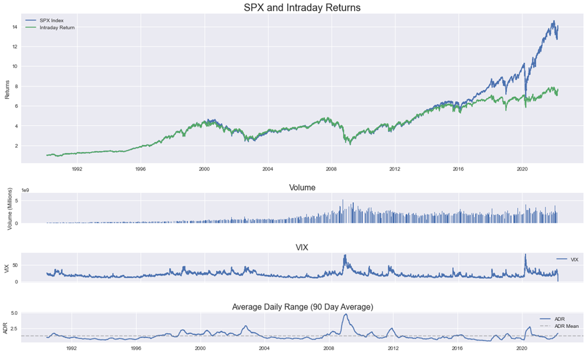

With the advent of the internet and democratization of the stock market making it accessible to millions of people globally, traders are constantly looking for better ways to generate alpha in the stock market. One of the most common ways to predict the direction and trend of an underlying is through ‘Technical Analysis’. Technical analysis allows traders to visualize the historical movement of an underlying and use mathematics such as moving averages, Bollinger bands, and other indicators to gain a deeper understanding of the health and momentum of an underlying.

This democratization of the stock market has also led to different patterns in market behavior over the last decade. There is an increasing number of brokerages that offer pre-market and after-hours trading privileges to retail traders. This paired with the rising popularity of quantitative hedge funds trading milliseconds after the news is made public has resulted in most of the major market moves occurring during the pre-market and after-hours. This can be seen in figure 1 highlighting the SPX’s total and intraday returns displaying a clear deviation in returns after 2016. The intraday returns plot is the cumulative returns of SPX only during the normal trading hours. The plot includes 32 years of historical data from 1990 to 2022 and we can notice a strict correlation between SPX’s total and intraday returns for most of the time from 1990 to 2016. The intraday returns trail that of the overall index during this period revealing that most of the returns are made during market hours.

> Figure 1 SPX and Intraday Returns with VIX and ADR
>
> 

The decreased intraday returns beginning in 2016 along with the fact that the average daily range has remained fairly similar to the period before signifies that there is still the same amount of intraday market range, that is between the high and low of the trading day, but the main difference being the reduced difference between the market close to open. This opens up an opportunity to find new ways to day trade and generate alpha that is appropriate for the current market behavior. This paper analyzes both day and short-term trades on SPX using pivot points to identify a potential edge to generate profits.

## Theory

One of the main elements of technical analysis is support and resistance levels. Support and resistance levels are not globally defined prices where an underlying is guaranteed to change direction or trend but rather it is a level where an underlying can be expected to struggle to move above or below that level. These levels are mainly caused due to speculation by traders and often align with common indicators like moving averages, previous highs and lows, and also round numbers.

Since there is no one way to identify levels of support and resistance, quants have developed various methods to define those levels in a more quantitative and replicable manner. Pivot points are one of those methods that provide a quantitative way to identify intraday support and resistance levels. Unlike traditional support and resistance levels derived from technical analysis, pivot points are computed numerically from the previous day’s open, high, low, and close prices. While there are numerous iterations of the pivot points such as the Camarilla, Tom DeMark’s, and Woodie pivot points, this paper will analyze the traditional pivot points. Moving forward, the term pivot points will be referring to the traditional. The formulas to calculate pivot points are highlighted in table 1 and a basic demonstration of the pivot points is displayed in figure 1.

Pivot points originated on the trading floor and were used extensively by floor traders from the 1980s and the use has expanded to also include professional and retail traders in the modern-day. Pivot points are also not designed to act as strict levels of support and resistance, instead, it provides key levels acting against the momentum and trigger mean reversion.

| Symbol | Name               |
| ------ | ------------------ |
| $O$    | Previous Day Open  |
| $H$    | Previous Day High  |
| $L$    | Previous Day Low   |
| $C$    | Previous Day Close |

| Symbol | Name         | Formula           |
| ------ | ------------ | ----------------- |
| $R3$   | Resistance 3 | $H + 2(P - L)$    |
| $R2$   | Resistance 2 | $P - L + H$       |
| $R1$   | Resistance 1 | $2P - L$          |
| $P$    | Pivot        | $(H + L + C) / 3$ |
| $S1$   | Support 1    | $2P - H$          |
| $S2$   | Support 2    | $P + L - H$       |
| $S3$   | Support 3    | $L + 2(H - P)$    |

Pivot points originated on the trading floor and were used extensively by floor traders from the 1980s and the use has expanded to also include professional and retail traders in the modern-day. Pivot points are also not designed to act as strict levels of support and resistance, instead, it provides key levels acting against the momentum and trigger mean reversion.

## Previous Work

Quantitative finance is a secretive field due to its very nature where trading strategies become less prevalent and actionable as the number of people looking for and trading based on those patterns increases. There have been a few research papers published exploring the ability to generate alpha using the traditional pivot points or a better variation of it in various markets. While there are numerous books describing the application of pivot points, there were no quantitative studies found in books or research papers discussing the ability of pivot points to generate alpha in the American Stock Markets. There are three main research papers of interest: the first one is “Optimization of Intraday Trading Strategy Based on ACD Rules and Pivot Point System in Chinese Market” [2], the second one is “Pivot Point Trading in the Foreign Exchange Market” [3], and the last one is “A study on the effectiveness of investment strategy based on the concept of pivot points levels using Matthews criterion” [3].

The aforementioned three research papers thoroughly examine the ability to profit off of pivot points and all have differing results and applicability. The first paper bolsters the effectiveness of pivot points in the Chinese futures market and supports the use of traditional pivot points where support levels act as long signals and resistance levels act as short signals. The second paper applies the pivot points in the Foreign Exchange market and finds the exact opposite where support levels act as short signals and resistance levels act as long signals where the trades are based on momentum rather than mean reversal. Lastly, the third research paper dismisses the use of pivot points to generate alpha as the randomness of the signals fails to provide an edge.

can be noticed that pivot points have been found by numerous quants to not be a pre-defined money-generating algorithm, instead it rather depends on the implementation of the strategy along with the market it is executed in.

## Implementation

This Paper also uses a new implementation of pivot points by categorizing each region between consecutive pivot points as a “zone” to study potential patterns between OHLC zones and market returns in the short term. The different zones and their bounds are described in table 2. Zones will be used in every study moving forward as it allows categorizing market patterns into 8 bins simplifying analysis and providing a straightforward way to develop strategies.

This paper aims to test multiple ways methodically and thoroughly to identify strategies that are capable of generating alpha. Due to the lack of publicly available historical intraday data paired with the complexity of developing backtests for the scope of this paper, the tests will use simple entry and exit points for trades based on daily data like open, high, low, and close prices. This should, however, not impact the credibility of the backtests and sufficient data from each analysis will be provided to justify the findings and future reference. The paper will be divided into the following two main scopes:

| Zone | Lower Bound | Upper Bound |
| ---- | ----------- | ----------- |
| 1    | ≥ R3        |             |
| 2    | ≥ R2        | < R3        |
| 3    | ≥ R1        | < R2        |
| 4    | ≥ PP        | < R1        |
| 5    | ≥ S1        | < PP        |
| 6    | ≥ S2        | < S1        |
| 7    | ≥ S3        | < S2        |
| 8    |             | < S3        |

1. Simple Patterns with Pivot Points and Zones.
   i. Provide detailed SPX, Pivot Points and Zones statistics that will be used in the backtests along with a point of future reference for further research into this topic.
   ii. Identify unique but common market behavior patterns that can be noticed with pivot points and zones.
2. Backtest intraday strategies using pivot points.
   i. Benchmark intraday returns to provide a basis to identify alpha-generating strategies.
   ii. Open to Close strategy analysis based on zones. Identify if going long or short based on an open zone can be used as a profitable strategy.
   iii. Open to Close Strategy combining long and short biases for each zone.

## Data

This paper uses publicly available SPX daily open, high, low, close, and volume (OHLCV) data along with VIX closing prices from February 1st, 1990, to March 31st, 2022. Using this data, various other metrics are calculated and described in table 3. Because the dataset contains over five thousand rows and close to forty columns of data, the full data set will not be included in this paper. Regardless, the column names and descriptions in table 3 should clarify terminology that may be displayed in future figures and tables. The dataset is time-series data with each row representing one trading day.

### SPX Statistics

| Statistic | Returns (%) | Intraday Range |
| --------- | ----------- | -------------- | ------ | ------ | ---------- | --------- | -------- | ------ |
|           | Daily       | Open           | High   | Low    | Open-Close | Open-High | Open-Low |        |
| Mean      | 0.039       | 0.008          | 0.611  | -0.632 | 0.031      | 0.603     | -0.640   | 1.243  |
| Median    | 0.059       | 0.000          | 0.437  | -0.407 | 0.055      | 0.412     | -0.406   | 1.002  |
| Std Dev   | 1.141       | 0.266          | 0.777  | 0.875  | 1.067      | 0.696     | 0.791    | 0.929  |
| Skewness  | -0.187      | -3.402         | 2.999  | -3.006 | -0.089     | 3.486     | -3.109   | 3.227  |
| Kurtosis  | 10.992      | 140.903        | 23.214 | 18.950 | 9.595      | 26.342    | 17.240   | 18.779 |

The following figures 3 and 4 display distributions of daily returns and intraday range along with the mean highlighted in the vertical red line. Additional distribution histograms for the other returns fields are provided in Appendix A. From the previous table and figures, we can notice that even though the mean daily return is only 0.04%, SPX has an intraday range median of 1%. This means that on most days, there is at least a 1% swing from the low to the high of the day, or vice-versa, providing an opportunity to profit off of the intraday swings.

The daily returns are normally distributed centered at 0.04% with a very slight left skew of -0.187 meaning that there is a slight upward bias for the daily returns. This slight upward bias and centuries-long upward trend of the SPX means that in general, a long-biased trade will be more profitable than a short trade. Especially because SPX averages 8% annually, a long-biased trade will be the main focus of the study, unless a specific strategy has been identified to consistently lose a long trade, then the trading strategy will be reversed to identify if the short-biased trade can generate profits.

### Pivot Point Statistics

The Pivot Points for SPX have the following statistical profile highlighted in the table below.

| Statistic | R3     | R2     | R1     | PP     | S1     | S2     | S3     |
| --------- | ------ | ------ | ------ | ------ | ------ | ------ | ------ |
| Mean      | 2.459  | 1.215  | 0.608  | -0.029 | -0.636 | -1.273 | -2.517 |
| Median    | 1.941  | 0.925  | 0.463  | -0.041 | -0.510 | -1.021 | -2.030 |
| Std Dev   | 1.922  | 1.027  | 0.513  | 0.389  | 0.497  | 0.994  | 1.888  |
| Skew      | 3.324  | 3.535  | 3.535  | 0.228  | -3.557 | -3.557 | -3.325 |
| Kurtosis  | 19.920 | 22.951 | 22.951 | 9.138  | 23.632 | 23.632 | 20.124 |

A few important observations can be noted with the means and medians of the Pivot Points.

1. R2 = 2x R1 and S2 = 2x S1
2. R3 = 2x R2 and S3 = 2x S2

While these observations may not have any direct implications on any strategy, they are still valuable nonetheless as the formulas do not explicitly declare these observations.

### Zones Statistics

The table below highlights the historical open, high, low, and close zones statistics for SPX. The left column highlights the frequency, and the right column highlights the percentage of occurrences for each zone to provide a deeper understanding of the distribution.

| Zone  | Open          | High          | Low           | Close         | Total |
| ----- | ------------- | ------------- | ------------- | ------------- | ----- |
| 1     | 3 (0.04%)     | 330 (4.07%)   | 0 (0.00%)     | 212 (2.62%)   | 546   |
| 2     | 46 (0.57%)    | 1461 (18.03%) | 24 (0.30%)    | 931 (11.49%)  | 2464  |
| 3     | 204 (2.52%)   | 1946 (24.01%) | 102 (1.26%)   | 1113 (13.73%) | 3368  |
| 4     | 4345 (53.61%) | 3226 (39.80%) | 1755 (21.65%) | 2311 (28.51%) | 11641 |
| 5     | 3344 (41.26%) | 1073 (13.24%) | 2778 (34.28%) | 1676 (20.68%) | 8876  |
| 6     | 121 (1.49%)   | 49 (0.60%)    | 1692 (20.88%) | 919 (11.34%)  | 2787  |
| 7     | 39 (0.48%)    | 17 (0.21%)    | 1343 (16.57%) | 730 (9.01%)   | 2136  |
| 8     | 3 (0.04%)     | 3 (0.04%)     | 411 (5.07%)   | 213 (2.63%)   | 638   |
| Total | 8105          | 8105          | 8105          | 8105          | 32456 |

| Statistic | Open  | High  | Low   | Close |
| --------- | ----- | ----- | ----- | ----- |
| Mean      | 4.42  | 3.43  | 5.44  | 4.36  |
| Median    | 4     | 4     | 5     | 4     |
| Std Dev   | 0.629 | 1.088 | 1.19  | 1.61  |
| Skew      | 0.125 | -0.24 | 0.311 | 0.142 |

### Zones-Pairs Analysis

#### Close Zone by Open Zone

| Open Zone | 1   | 2   | 3    | 4    | 5    | 6   | 7   | 8   | Total |
| --------- | --- | --- | ---- | ---- | ---- | --- | --- | --- | ----- |
| 1         | 0   | 3   | 0    | 0    | 0    | 0   | 0   | 0   | 3     |
| 2         | 21  | 16  | 4    | 1    | 1    | 2   | 1   | 0   | 46    |
| 3         | 22  | 78  | 46   | 30   | 19   | 7   | 1   | 1   | 204   |
| 4         | 125 | 606 | 629  | 1572 | 637  | 445 | 263 | 68  | 4345  |
| 5         | 44  | 224 | 431  | 690  | 993  | 429 | 426 | 107 | 3344  |
| 6         | 0   | 4   | 3    | 14   | 25   | 28  | 30  | 17  | 121   |
| 7         | 0   | 0   | 0    | 4    | 1    | 8   | 9   | 17  | 39    |
| 8         | 0   | 0   | 0    | 0    | 0    | 0   | 0   | 3   | 3     |
| Total     | 212 | 931 | 1113 | 2311 | 1676 | 919 | 730 | 213 | 8105  |

| Statistic | Open Zone |       |       |       |        |        |        |      |
| --------- | --------- | ----- | ----- | ----- | ------ | ------ | ------ | ---- |
|           | 1         | 2     | 3     | 4     | 5      | 6      | 7      | 8    |
| Mean      | 2.00      | 2.02  | 2.88  | 4.09  | 4.76   | 5.88   | 6.87   | 8.00 |
| Median    | 2         | 2     | 3     | 4     | 5      | 6      | 7      | 8    |
| Std Dev   | 0.000     | 1.453 | 1.356 | 1.519 | 1.551  | 1.495  | 1.301  | 0    |
| Skew      | 0.000     | 2.006 | 0.874 | 0.278 | -0.038 | -0.544 | -1.034 | 0    |

#### High Zone by Open Zone

| Open Zone | 1   | 2    | 3    | 4    | 5    | 6   | 7   | 8   | Total |
| --------- | --- | ---- | ---- | ---- | ---- | --- | --- | --- | ----- |
| 1         | 3   | 0    | 0    | 0    | 0    | 0   | 0   | 0   | 3     |
| 2         | 25  | 21   | 0    | 0    | 0    | 0   | 0   | 0   | 46    |
| 3         | 42  | 121  | 41   | 0    | 0    | 0   | 0   | 0   | 204   |
| 4         | 198 | 973  | 1157 | 2017 | 0    | 0   | 0   | 0   | 4345  |
| 5         | 61  | 340  | 740  | 1183 | 1020 | 0   | 0   | 0   | 3344  |
| 6         | 1   | 6    | 8    | 21   | 44   | 41  | 0   | 0   | 121   |
| 7         | 0   | 0    | 0    | 5    | 9    | 8   | 17  | 0   | 39    |
| 8         | 0   | 0    | 0    | 0    | 0    | 0   | 0   | 3   | 3     |
| Total     | 330 | 1461 | 1946 | 3226 | 1073 | 49  | 17  | 3   | 8105  |

| Statistic | Open Zone |       |       |        |        |        |        |      |
| --------- | --------- | ----- | ----- | ------ | ------ | ------ | ------ | ---- |
|           | 1         | 2     | 3     | 4      | 5      | 6      | 7      | 8    |
| Mean      | 1.00      | 1.46  | 2.00  | 3.15   | 3.83   | 4.85   | 5.95   | 8.00 |
| Median    | 1         | 1     | 2     | 3      | 4      | 5      | 6      | 8    |
| Std Dev   | 0         | 0.503 | 0.639 | 0.921  | 1.033  | 1.159  | 1.099  | 0    |
| Skew      | 0         | 1.805 | 0.004 | -0.649 | -0.598 | -1.074 | -0.521 | 0    |

#### Low Zone by Open Zone

| Open Zone | 1   | 2   | 3   | 4    | 5    | 6    | 7    | 8   | Total |
| --------- | --- | --- | --- | ---- | ---- | ---- | ---- | --- | ----- |
| 1         | 0   | 2   | 1   | 0    | 0    | 0    | 0    | 0   | 3     |
| 2         | 0   | 22  | 10  | 9    | 2    | 1    | 1    | 1   | 46    |
| 3         | 0   | 0   | 91  | 53   | 25   | 17   | 16   | 2   | 204   |
| 4         | 0   | 0   | 0   | 1693 | 1248 | 810  | 473  | 121 | 4345  |
| 5         | 0   | 0   | 0   | 0    | 1503 | 846  | 778  | 217 | 3344  |
| 6         | 0   | 0   | 0   | 0    | 0    | 18   | 62   | 41  | 121   |
| 7         | 0   | 0   | 0   | 0    | 0    | 0    | 13   | 26  | 39    |
| 8         | 0   | 0   | 0   | 0    | 0    | 0    | 0    | 3   | 3     |
| Total     | 0   | 24  | 102 | 1755 | 2778 | 1692 | 1343 | 411 | 8105  |

| Statistic | Open Zone |       |       |       |       |        |        |      |
| --------- | --------- | ----- | ----- | ----- | ----- | ------ | ------ | ---- |
|           | 1         | 2     | 3     | 4     | 5     | 6      | 7      | 8    |
| Mean      | 2.33      | 3.07  | 4.12  | 5.10  | 5.91  | 7.19   | 7.67   | 8.00 |
| Median    | 2         | 3     | 4     | 5     | 6     | 7      | 8      | 8    |
| Std Dev   | 0.577     | 1.405 | 1.326 | 1.119 | 0.967 | 0.675  | 0.228  | 0    |
| Skew      | 1.732     | 1.690 | 1.073 | 0.749 | 0.606 | -0.248 | -0.736 | 0    |

### Analysis

Trends based on Open Zones:

- **1**: Whenever SPX gaps up to zone 1, we can notice that it always trades lower and closes in zone 2 with the low of the day also in zone 2 or 3. This allows us to trade short on these days with a high probability of profit to the downside.
- **2**: With zone 2 however, we can notice a different pattern where there is a relatively high chance of running up to zone 1 and close at or above zone 2. However, there is a lot higher relative risk to the downside as the lows and closes are noted to come down to the lowest zone 8.
- **3-6**: With zones 3 through 6, there is a much more standard distribution of highs, lows, and closes. The major difference between the zones is a slight upward bias with zones 3 and 4 and a downward bias with zones 5 and 6. These zone pairs are separated by the Pivot Point level and this will act as a key level used in future strategies.
- **7**: Zone 7 does not exhibit an opposite pattern to 2 instead when SPX was noted to gap down to zone 7, it can be expected that there is a high probability it will continue to remain at the same or lower level at the close with not much of a tailed bias to the upside.
- **8**: No clear pattern can be noticed with a gap down to zone 8 at open, but since there is a lot of panic selling happening pre-market, there is likely bound to be an elevated VIX and greater downside risk in the short term.

## Intraday Trading Strategies and Analysis

### Benchmarks

There will be two benchmarks that will be used to evaluate the performance of the strategies. The primary benchmark will be the SPX performance and the secondary benchmark will be the intraday performance of SPX. Considering that the strategies will primarily be intraday trading strategies, beating the intraday SPX returns will be considered a must for an alpha-generating strategy. Furthermore, beating the overall SPX index will be a market-beating strategy.

| Statistic | Value                |
| --------- | -------------------- |
| Equation  | $y = 1.650x + 0.026$ |
| Mean      | $0.039\%$            |
| Std Dev   | $1.141\%$            |
| $R^2$     | $0.148$              |
| Median    | $0.059\%$            |
| Skew      | $-0.187$             |

| Returns          | Total      | Annualized |
| ---------------- | ---------- | ---------- |
| SPX Returns      | $1282.6\%$ | $12.56\%$  |
| Intraday Returns | $654.5\%$  | $9.53\%$   |

### Single Zone Strategy

This strategy buys at market price at open and sells at market price at close for each open zone.

#### 1922 to 2022

| Returns    | 1         | 2         | 3         | 4          | 5         | 6          | 7          | 8         |
| ---------- | --------- | --------- | --------- | ---------- | --------- | ---------- | ---------- | --------- |
| Total      | $-1.55\%$ | $13.76\%$ | $68.34\%$ | $242.70\%$ | $89.07\%$ | $-19.33\%$ | $-20.90\%$ | $-3.09\%$ |
| Annualized | $-0.07\%$ | $0.58\%$  | $2.37\%$  | $5.70\%$   | $2.91\%$  | $-0.96\%$  | $-1.05\%$  | $-0.14\%$ |

#### 2016 to 2022

| Returns    | 1         | 2         | 3         | 4         | 5          | 6         | 7          | 8         |
| ---------- | --------- | --------- | --------- | --------- | ---------- | --------- | ---------- | --------- |
| Total      | $-1.55\%$ | $15.85\%$ | $44.82\%$ | $35.87\%$ | $-14.07\%$ | $-9.32\%$ | $-22.92\%$ | $-3.09\%$ |
| Annualized | $-0.36\%$ | $3.47\%$  | $8.97\%$  | $7.37\%$  | $-3.46\%$  | $-2.24\%$ | $-5.86\%$  | $-0.73\%$ |

### Combined Zones Strategy

The main principle behind this strategy is to go long if the open is above the Pivot Point and to go short if the open is below the Pivot Point. This decision was based on the pattern noticed in the zone-pairs analysis section along with the Single Zones strategy where the pivot points level played a key role in determining the intraday direction after opening.

#### 1922 to 2022

This strategy produced a total return of $245.2\%$, equivalent to $5.74\%$ annualized over 30 years.

#### 2016 to 2022

This strategy produced a total return of $263.25\%$, equivalent to $34.87\%$ annualized over 6 years.

## Conclusion

With the main goal of finding alpha day-trading SPX using Pivot Points strategies, the “Combined Zones” strategy is found to consistently generated profits during the last few years. As highlighted in the last section, the strategy not only underperforms in the market from 2003 to 2009, instead it is unprofitable all of those years when the market has been profitable during that period. There is no specific reason that results in the unprofitability of this strategy during this period, but the main reason comes down to the main principle of this strategy. Essentially, it can be said that during this time, most of the time, the long bias when the open is above the pivot point level and vice-versa turns out to be the opposite most of the time during this period. However, following the bottom of the financial crisis in 2010, a steady uptrend can be noticed. Because the strategy has the majority of the value before this, the returns value is portrayed as less than it is from 2010 to 2022. To prevent overfitting and sticking to the main goal of the paper to find a strategy that works best following 2016 when the intraday returns and total returns diverged the most, only this period is studied in depth.

This research also assumes no fees, commissions, or spreads. Considering that the research was focused on SPX, the most direct equity ETF would be SPY. Most brokerages offer commission-free trading on SPY and therefore this assumption does not entirely affect the returns of the backtests. The only major factor would be the spread and trade getting filled consistently the sum of large numbers can help the green days outweigh the red days. Overall, this research does shed a positive light on the benefits of using Pivot Points for intraday strategies, at least on SPX and its related equity funds.

One of the major pitfalls of this research is that it does not assume any portfolio management and only considers the trade as a whole where a whole unit of SPX or a related asset is traded. This leads to a very hard recovery from downtrends as seen during the 2000 and 2008 recessions. Because there is no stop or trailing limits in place, the entire daily return is absorbed both on green and red days. This is mainly a problem recovering from downsides because an exponentially larger positive return needs to be achieved to break even from a few consecutive bad trades.

Further work needs to be done to analyze appropriate risk and portfolio management on top of this strategy to identify the feasibility of this strategy in the long term. Along with this, further trades using derivatives and leverage can be used to amplify returns and needs to be studied. A potential feasible trade idea is the use of vertical spreads to profit off of short-term trades while limiting

The research does not offer any direct financial advice and merely tries to quantify the patterns noticed in the broad market SP 500 index. The research is based on historical data and does not guarantee future returns.

## References

1. Pivot Points (Resistance and Support) [Figure]. Fidelity. www.fidelity.com/learning-center/trading-investing/technical-analysis/technical-indicator-guide/pivot-points-resistance-support
2. Tian, X., Quan, C., Zhang, J., & Cai, H. J. (2012). Optimization of intraday trading strategy based on ACD rules and pivot point system in Chinese market. Journal of Intelligent Learning Systems and Applications, 4(04), 279.
3. Johnsson, O., & Frykmer, D. (2019). Pivot Point Trading in the Foreign Exchange Market-A Test for Market Efficiency.
4. Wiliński, A., Nyczaj, T., Bera, A., & Błaszyński, P. (2013). A study on the effectiveness of investment strategy based on the concept of pivot points levels using Matthews criterion. Journal of Theoretical and Applied Computer Science, 7(4), 42-55.

## Appendix

### Data Terminology

| Column Name         | Description                                  |
| ------------------- | -------------------------------------------- |
| `open`              | SPX price at market open                     |
| `high`              | SPX's highest price during the trading day   |
| `low`               | SPX's lowest price during the trading day    |
| `close`             | SPX price at market close                    |
| `volume`            | SPX trading volume                           |
| `vix`               | VIX closing price                            |
| `daily_return`      | SPX returns from the previous close to close |
| `open_return`       | SPX returns from the previous close to open  |
| `high_return`       | SPX returns from the previous close to high  |
| `low_return`        | SPX return from previous close to low        |
| `open_close_return` | SPX return from open to close                |
| `open_high_return`  | SPX return from open to high                 |
| `open_low_return`   | SPX return from open to low                  |
| `range`             | SPX range from high to low                   |
| `PP`                | Pivot Point                                  |
| `S1`                | Support 1                                    |
| `R1`                | Resistance 1                                 |
| `S2`                | Support 2                                    |
| `R2`                | Resistance 2                                 |
| `S3`                | Support 3                                    |
| `R3`                | Resistance 3                                 |
| `p_high`            | Previous high price                          |
| `p_low`             | Previous low price                           |
| `PP_return`         | SPX return from previous close to PP         |
| `S1_return`         | SPX return from the previous close to S1     |
| `R1_return`         | SPX return from the previous close to R1     |
| `S2_return`         | SPX return from previous close to S2         |
| `R2_return`         | SPX return from previous close to R2         |
| `S3_return`         | SPX return from previous close to S3         |
| `R3_return`         | SPX return from previous close to R3         |
| `close_zone`        | SPX close price zone based on pivot points   |
| `open_zone`         | SPX open price zone based on pivot points    |
| `high_zone`         | SPX high price zone based on pivot points    |
| `low_zone`          | SPX low price zone based on pivot points     |
